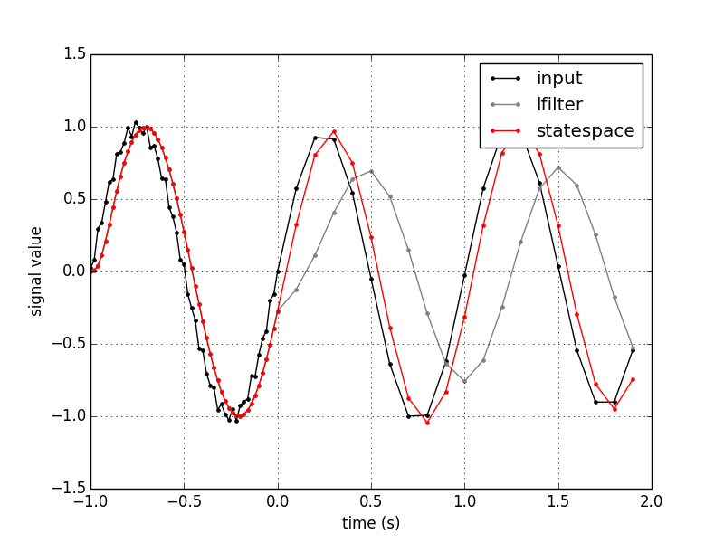

This repo is my exploration of some of the filtering methods from [IIR Digital Filtering of Non-uniformly Sampled Signals via State Representation](https://pdfs.semanticscholar.org/5078/0671847de20969fa653b689d0ce5ea05d0af.pdf) by L. Fesquet and B. Bidégaray-Fesquet. The
paper presents methods for implementing digital IIR filters which work correctly with inputs that are not sampled at a
uniform rate.

To see the difference that this makes, here's an example of a signal which changes sampling rate from 50 Hz to 10 Hz at
t=0, filtered using `scipy.signal.lfilter()` and with one of the methods from the paper:

In this example, the input signal is a pure sinewave, but the time vector at which it's sampled is very irregular:

You can see that `lfilter()` doesn't handle the changes in sampling rate well, but the method presented in this paper
does.
